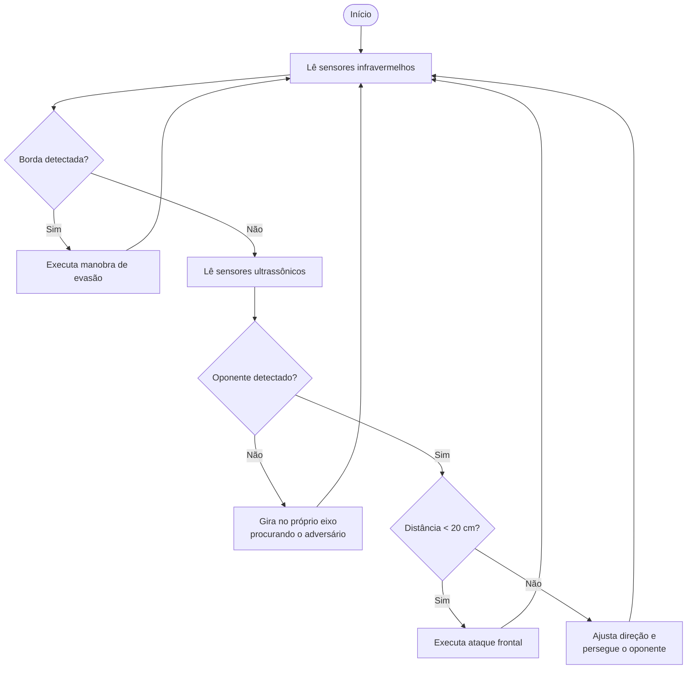
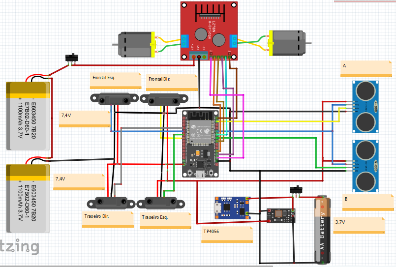
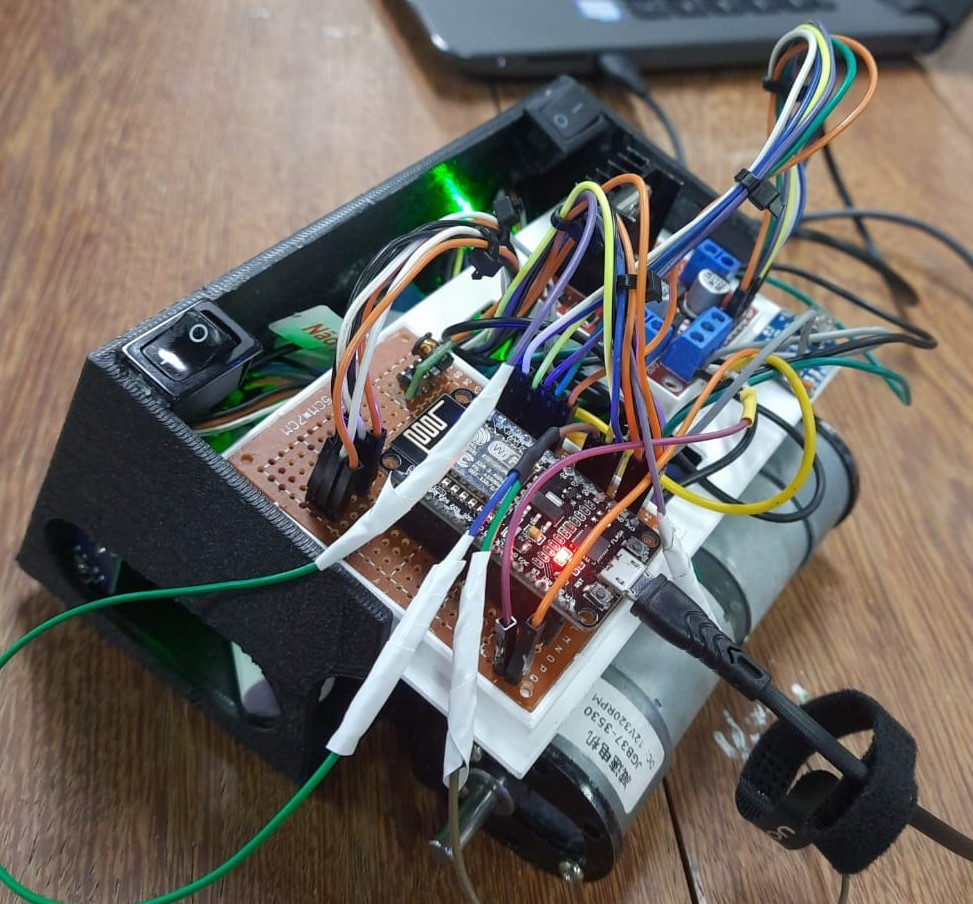

# Robô Sumô - Versão 2

Projeto de robótica embarcada desenvolvido pelo **PETEE – UFMG** em parceria com a escola Fundação Torino, em 2024. O robô detecta o oponente e os limites da arena por meio de sensores, realizando de forma autônoma ações de perseguição e evasão

---

## Sumário

- [Objetivos](#-objetivos)
- [Como Funciona](#-como-funciona)
- [Materiais Necessários](#-materiais-necessários)
- [Esquemático e Ligações](#-esquemático-e-ligações)
- [Código](#-código)
- [Processo de Montagem](#️-processo-de-montagem)
- [Protótipo Final](#-protótipo-final)
- [Referências](#-referências)
- [Equipe](#-equipe)
- [Licença](#-licença)

---

## 🎯 Objetivos

- Demonstrar, por meio de uma aplicação prática, os conceitos de robótica, eletrônica e programação embarcada.
Desenvolver um chassi personalizado que atenda aos requisitos mecânicos do projeto e dimensionais estabelecidos pelo regulamento da CoRA.
- Desenvolver e implementar um sistema autônomo de detecção e perseguição ao robô adversário.
- Desenvolver e implementar um sistema de detecção das bordas da arena e de evasão, garantindo a permanência do robô na área de competição.
- Projetar e construir um robô competitivo para participação em competições de robô sumô. 
- Elaborar documentação técnica, didática e de fácil manutenção, de modo a facilitar a reprodução e a continuidade do projeto por estudantes e futuros integrantes do PETEE.
- Incentivar o aprendizado de automação, sensores e sistemas embarcados de forma acessível.
- Promover o aprendizado de automação, instrumentação, sensores e sistemas embarcados por meio de uma plataforma prática e acessível.

---

## ⚙️ Como Funciona

O robô opera em um ciclo contínuo de execução, no qual a detecção das bordas da arena possui prioridade sobre as demais ações. Inicialmente, os sensores infravermelhos verificam a presença da borda e, caso seja detectada, o sistema executa uma manobra de evasão para garantir que o robô permaneça na área de competição. Na ausência de bordas, os sensores ultrassônicos são utilizados para localizar o oponente. Quando nenhum adversário é detectado, o robô realiza uma varredura por meio da rotação sobre o próprio eixo. Uma vez identificado o oponente, o sistema ajusta a trajetória para persegui-lo e, ao atingir uma distância pré-estabelecida, executa um ataque frontal.



> A distância máxima para detecção do oponente é definida pela constante `limiteDetecao` (padrão: **40 cm**).
> A velocidade dos motores pode ser ajustada por meio das constantes `VELOCIDADE_MIN ("ALTERE AQUI")` e `VELOCIDADE_MAX ("ALTERE AQUI")`.
> O tempo das manobras de evasão é configurado pelas constantes `TEMPO_RE` (padrão: **300 ms**) e `TEMPO_ACAO` (padrão: **400 ms**).
> A distância mpaxima para exercutrar a função `ataqueCurto()` é **20 cm**.

---

### Lógica da Ponte H (L298N)

A Ponte H controla a **direção** de cada motor por meio dos pinos digitais de direção e a **velocidade** por sinais PWM gerados pelo ESP32.

| Movimento | Motor A IN1 | Motor A IN2 | Motor B IN3 | Motor B IN4 |
|:----------:|:-----------:|:-----------:|:-----------:|:-----------:|
| Frente | LOW | HIGH | LOW | HIGH |
| Ré | HIGH | LOW | HIGH | LOW |
| Giro à esquerda | LOW | HIGH | HIGH | LOW |
| Giro à direita | HIGH | LOW | LOW | HIGH |
| Parado | LOW | LOW | LOW | LOW |

> A velocidade dos motores é controlada pelos pinos PWM `MOTOR_A_PWM` e `MOTOR_B_PWM`, por meio da função `analogWrite()`, enquanto a direção é definida pela combinação lógica dos pinos `IN1`, `IN2`, `IN3` e `IN4`.
 
---

## 🧰 Materiais Necessários

| Componente | Qtd. | Modelo | Descrição | Datasheet |
|-----------|:----:|--------|-----------|:---------:|
| Motor DC com Caixa de Redução | 2 | 25GA370 | Tração do robô | [PDF](https://d229kd5ey79jzj.cloudfront.net/980/Desenho_Tecnico_Motor_25GA370-26X-6V-320RPM.PDF) |
| Ponte H | 1 | L298N | Driver de motor — controla direção e velocidade | [PDF](https://www.makerhero.com/img/files/download/L298-Datasheet.pdf) |
| Conversor DC-DC Step-UP | 1 | RS3220 | Eleva a tensão da bateria para 5 V. | — |
| Microcontrolador | 1 | NodeMCU ESP32 | Cérebro do robô | [PDF](https://documentation.espressif.com/esp32-wroom-32_datasheet_en.pdf) |
| Sensor Ultrassônico | 2 | HC-SR04 | Detecção de adversários por tempo de voo do pulso sonoro | [PDF](https://cdn.sparkfun.com/datasheets/Sensors/Proximity/HCSR04.pdf) |
| Sensor Infravermelho | 4 | HW-201 | Detecção das bordas da arena por reflexão de luz infravermelha.  | [Site](https://www.usinainfo.com.br/sensor-de-linha/sensor-de-obstaculo-reflexivo-infravermelho-hw-201-com-ajuste-de-sensibilidade-8379.html?srsltid=AfmBOorPozxzI0-Kdzi3NFfwDFDGgjNiZ4EwzKwK-A2-uomO2TYlUESy) |
| Bateria LiPo | 2 | 7,4 V · 2200 mAh · 30C | Alimentação da Ponte-H e motores | — |
| Bateria Li-Ion Recarregável | 1 | 3,7 V · 2600 mAh | Alimentação do Arduino e sensores| — |
| Módulo Carregador de Bateria | 1 | TP4056 | Recarga da batéria de Li-Ion | [PDF](https://makerhero.com/img/files/download/TP4056-Datasheet.pdf) |
| Suporte p/ sensor| 1 | Blackskull | Fixação do sensor no chasse| [PDF](https://d229kd5ey79jzj.cloudfront.net/900/Desenho_Tecnico_Suporte_Ultrasonico.pdf) |

> As rodas do robô foram desenvolvidas pelo grupo, sendo confeccionadas com um corpo impresso em 3D e revestidas com silicone moldado para aumentar a aderência à arena.

---

## 📐 Esquemático e Ligações

<p align="center">
  
</p>

<p align="center"><em>Figura 1 — Diagrama de ligações: robô sumô.</em></p>

---

### Mapeamento de Pinos

| Pino Arduino | Componente | Tipo de Sinal | Função |
|:------------:|-----------|:-------------:|--------|
| D4 | L298N – IN1 | Digital | Direção Motor Esquerdo (bit 1) |
| D5 | L298N – IN2 | Digital | Direção Motor Esquerdo (bit 2) |
| D16 *(PWM)* | L298N – ENA | PWM | Velocidade Motor Esquerdo |
| D17 | L298N – IN3 | Digital | Direção Motor Direito (bit 1) |
| D19 | L298N – IN4 | Digital | Direção Motor Direito (bit 2) |
| D23 *(PWM)* | L298N – ENB | PWM | Velocidade Motor Direito |
| D21 | HC-SR04 Todos– Trig | Digital (saída) | Dispara o pulso ultrassônico |
| D22 | HC-SR04 Esquerdo – Echo | Digital (entrada) | Recebe o eco do pulso, frente e esquerda|
| D18 | HC-SR04 Direito – Echo | Digital (entrada) | Recebe o eco do pulso, frente e direita |
| VIN | HC-SR04  Todos – VCC | Alimentação | Energia do sensor |
| VIN | HW-201 Todos – VCC | Alimentação | Energia do sensor |
| D35 | HW-201 Frontal Esquerdo – OUT | Digital (entrada) | Recebe a reflexão da luz infravermelha, frente à esquerda |
| D33 | HW-201 Frontral Direito – OUT | Digital (entrada) | Recebe a reflexão da luz infravermelha, frente à direita|
| D32 | HW-201 Traseiro Esquerdo – OUT | Digital (entrada) | Recebe a reflexão da luz infravermelha, atrás à esquerda |
| D34 | HW-201 Traseiro Direito – OUT | Digital (entrada) | Recebe a reflexão da luz infravermelha, atrás à direita |
| GND | Todos os GNDs | Referência | Terra comum do circuito |

---

## 💻 Código

O código completo está em [`src/sumo.ino`](src/sumo.ino). Sua implementação é modular, sendo organizada em funções responsáveis pelo controle dos motores, leitura dos sensores, detecção de borda, perseguição ao oponente e execução das estratégias de ataque.

| Função | Descrição |
|--------|-----------|
| `moveForwardInstantaneo()` | Move os dois motores para frente na velocidade especificada. |
| `moveBackwardInstantaneo()` | Move os dois motores para trás na velocidade especificada. |
| `curveLeftInstantaneo()` | Controla os motores para realizar uma curva à esquerda. |
| `curveRightInstantaneo()` | Controla os motores para realizar uma curva à direita. |
| `stopMotors()` | Interrompe completamente o movimento dos dois motores. |
| `detectarBorda()` | Verifica os sensores infravermelhos e executa uma manobra de evasão caso uma borda seja detectada. |
| `measureDistance()` | Mede a distância até um obstáculo utilizando um sensor ultrassônico. |
| `perseguirOponente()` | Ajusta a trajetória do robô para perseguir o adversário com base nas leituras dos sensores ultrassônicos. |
| `ataqueCurto()` | Executa um ataque frontal de curta duração, interrompendo a ação caso uma borda seja detectada. |
| `DetectarOponente()` | Realiza uma varredura girando o robô sobre o próprio eixo quando nenhum adversário é detectado. |

---

### Parâmetros Ajustáveis

O comportamento do robô pode ser personalizado por meio das constantes definidas no início do código:

```cpp
#define VELOCIDADE_MIN 80      // PWM mínimo aplicado aos motores
#define VELOCIDADE_MAX 255     // PWM máximo aplicado aos motores
#define limiteDetecao 40.0     // Distância máxima (cm) para detectar o oponente

#define TEMPO_RE 300           // Tempo de recuo ao detectar a borda (ms)
#define TEMPO_ACAO 400         // Tempo de avanço após detectar a borda traseira (ms)

#define TEMPO_RAMPA 5          // Intervalo entre atualizações da rampa (ms)
#define PASSO_RAMPA 5          // Incremento/decremento do PWM por atualização
```

A lógica de ataque também pode ser ajustada modificando a distância mínima para iniciar o ataque frontal na função `perseguirOponente()`:

```cpp
if (distanciaA < 20 || distanciaB < 20) {
    ataqueCurto();
}
```

> Aumente esse valor para iniciar o ataque a uma distância maior ou reduza-o para que o robô se aproxime mais do adversário antes de atacar.

---

### Bibliotecas Necessárias

O projeto utiliza apenas a biblioteca padrão da Arduino IDE para ESP32:

```cpp
#include <Arduino.h>
```

> Não é necessária a instalação de bibliotecas adicionais para o funcionamento do robô, uma vez que a leitura dos sensores ultrassônicos, o controle dos motores e a comunicação serial são implementados utilizando as funções nativas da plataforma Arduino.

---

## 🛠️ Processo de Montagem

1. **Planejamento** — Definir os requisitos do robô de acordo com o regulamento da competição, incluindo dimensões, peso, estratégia de combate e seleção dos componentes eletrônicos e mecânicos.

2. **Montagem mecânica** — Fixar os motores ao chassi, instalar as rodas confeccionadas pela equipe, montar a lâmina frontal e posicionar os sensores de acordo com o projeto.

3. **Montagem eletrônica** — Conectar o ESP32, a ponte H (L298N), os sensores ultrassônicos, os sensores infravermelhos, o conversor Step-Up e o módulo TP4056, conforme o esquemático elétrico do projeto. Verificar toda a alimentação antes da energização.

4. **Teste individual dos componentes** — Validar separadamente o funcionamento dos motores, sensores ultrassônicos, sensores infravermelhos e do sistema de alimentação antes da integração completa.

5. **Upload do código** — Gravar o arquivo `sumo.ino` utilizando a Arduino IDE. Durante os testes, utilizar o **Monitor Serial** para acompanhar as leituras dos sensores e o comportamento do robô.

6. **Calibração** — Ajustar os parâmetros de velocidade, distância de detecção do oponente, tempos das manobras de evasão e ataque, conforme as características da arena e o desempenho observado durante os testes.

> **Dica:** Caso algum motor gire no sentido contrário ao esperado, basta inverter os fios do motor na ponte H ou alterar a lógica dos pinos de direção (`IN1`/`IN2` ou `IN3`/`IN4`) no código, sem necessidade de modificar as conexões do ESP32.
>
> ---
>
> ## 📷 Protótipo Final

<p align="center">
  
</p>

<p align="center"><em>Figura 2 — Protótipo montado: visão superior traseira.</em></p>

---

## 👥 Equipe

| Papel | Nome |
|-------|------|
| Organização | PETEE – UFMG |
| Petiano responsável | Henrique Miranda |
| Tutor | Fernando de Oliveira Souza |

---

## 📢 Licença

Projeto aberto para fins didáticos. Ao utilizar ou adaptar este material, cite **PETEE – UFMG** como fonte.
